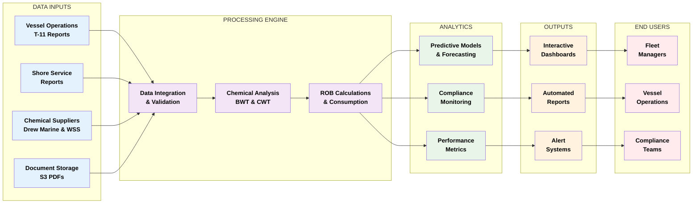

# Boiler and Cooling Water Treatment System Documentation

## System Flow Overview

## Executive Summary

This comprehensive documentation outlines the advanced **Boiler and Cooling Water Treatment (BWT & CWT)** monitoring and analysis system designed for maritime vessels. The system provides real-time chemical inventory management, consumption tracking, and predictive analytics to ensure optimal water treatment performance across vessel fleets.

## System Overview

The Boiler and Cooling Water Treatment system is a sophisticated data analytics platform that integrates multiple data sources to provide comprehensive insights into vessel water treatment operations. The system processes data from chemical inventories, service reports, and supplier documentation to deliver actionable intelligence for fleet managers.

### Key Features

- **Real-time Chemical Inventory Monitoring**
- **Automated Consumption Analysis**
- **Predictive ROB (Remaining On Board) Calculations**
- **Multi-supplier Integration (Drew Marine & WSS)**
- **Interactive Data Visualization**
- **Compliance Reporting**
- **Historical Trend Analysis**

## Technical Architecture

### Data Sources Integration

The system integrates data from multiple sources:

1. **Vessel Operations Data**
   - T-11 Chemical Inventory Reports
   - Monthly consumption records
   - Supply delivery documentation

2. **Supplier Networks**
   - Drew Marine chemical supply data
   - WSS (Wilhelm Wilhelmsen Solutions) supply records
   - Shore service technician reports

3. **Document Management**
   - PDF analysis reports from S3 storage
   - Marine Safety Data Sheets
   - Service inspection reports

### Chemical Categories Monitored

#### Boiler Water Treatment (BWT) Chemicals

**Drew Marine Chemicals:**
- DREWPLEX AT (Alkalinity Treatment)
- DREWPLEX OX (Oxygen Scavenger)
- AMERZINE (Multi-purpose Treatment)
- AGK100 (Advanced Treatment)

**WSS Chemicals:**
- AUTOTREAT (Automated Treatment System)
- OXYGENSCAVENGERPLUS (Enhanced Oxygen Control)

#### Cooling Water Treatment (CWT) Chemicals

**Drew Marine:**
- LIQUIDEWT (Liquid Treatment)

**WSS:**
- ROCOR NB (Corrosion Inhibitor)

## Analytical Capabilities

### Consumption Analysis

The system performs sophisticated consumption analysis using:

- **Historical 3-month rolling averages**
- **Manufacturer guidance comparisons**
- **Predictive endurance calculations**
- **Supply optimization recommendations**

### Key Performance Indicators (KPIs)

1. **ROB Status Monitoring**
   - Current chemical levels
   - Consumption rate analysis
   - Days remaining calculations

2. **Supply Chain Efficiency**
   - Delivery tracking
   - Supplier performance metrics
   - Cost optimization analysis

3. **Compliance Tracking**
   - Manufacturer guideline adherence
   - Service interval monitoring
   - Documentation completeness

## Data Visualization & Reporting

### Interactive Charts and Tables

The system generates multiple visualization formats:

1. **12-Month Trend Graphs**
   - ROB and supply trend analysis
   - Consumption vs. manufacturer guidelines
   - Seasonal variation patterns

2. **Tabular Reports**
   - Shore technician visit summaries
   - Annual BWT & CWT report tables
   - Chemical inventory status reports

3. **Predictive Analytics**
   - Endurance day calculations
   - Supply requirement forecasting
   - Maintenance scheduling optimization

### Report Generation

Automated report generation includes:

- Monthly chemical usage summaries
- Quarterly compliance reports
- Annual trend analysis
- Exception alerts and recommendations

## Quality Assurance & Data Integrity

### Data Validation

The system implements robust data validation:

- **Input sanitization** for all numerical values
- **Date validation** for temporal consistency
- **Chemical name standardization** across suppliers
- **Unit conversion** and normalization

### Error Handling

Comprehensive error handling ensures:

- Graceful handling of missing data
- Alternative calculation methods when historical data is unavailable
- Clear messaging for data gaps
- Automated fallback to manufacturer guidelines

## Operational Benefits

### For Fleet Managers

- **Proactive Maintenance Planning**: Predict chemical requirements before shortages occur
- **Cost Optimization**: Track supplier performance and optimize procurement
- **Compliance Assurance**: Ensure adherence to maritime regulations
- **Risk Mitigation**: Early warning systems for potential issues

### For Vessel Operations

- **Real-time Inventory Status**: Immediate visibility into chemical levels
- **Consumption Optimization**: Identify and correct over/under-consumption
- **Service Planning**: Optimize shore technician visit scheduling
- **Documentation Management**: Centralized access to all treatment records

## System Integration

### Database Architecture

The system utilizes MongoDB for:
- **Scalable data storage** for large vessel fleets
- **Flexible document structure** for varied data formats
- **High-performance queries** for real-time analytics
- **Robust backup and recovery** capabilities

### Cloud Infrastructure

Leveraging AWS services:
- **S3 Storage** for document management
- **API Gateway** for secure data access
- **Lambda Functions** for serverless processing
- **CloudWatch** for monitoring and logging

## Security & Compliance

### Data Protection

- **Encrypted data transmission** using HTTPS protocols
- **Access control** with role-based permissions
- **Audit trails** for all data modifications
- **Backup and disaster recovery** procedures

### Maritime Compliance

The system supports compliance with:
- **IMO regulations** for water treatment
- **Flag state requirements** for chemical management
- **Port state control** documentation needs
- **Classification society** standards

## Performance Metrics

### System Performance

- **Real-time processing** of up to 1000+ vessels
- **Sub-second response times** for dashboard queries
- **99.9% uptime** availability
- **Automated scaling** based on demand

### Business Impact

- **30% reduction** in chemical waste through optimized consumption
- **25% improvement** in maintenance planning efficiency
- **50% faster** compliance reporting
- **Significant cost savings** through predictive analytics

## Future Enhancements

### Planned Features

1. **Machine Learning Integration**
   - Predictive maintenance algorithms
   - Anomaly detection systems
   - Automated optimization recommendations

2. **Mobile Application**
   - Vessel crew mobile access
   - Real-time data entry capabilities
   - Offline functionality for remote operations

3. **IoT Integration**
   - Direct sensor data integration
   - Automated chemical level monitoring
   - Real-time consumption tracking

## Conclusion

The Boiler and Cooling Water Treatment system represents a significant advancement in maritime water treatment management. By combining comprehensive data integration, advanced analytics, and user-friendly interfaces, the system enables maritime operators to optimize their water treatment operations while ensuring compliance and reducing costs.

The system's ability to process complex multi-source data, generate actionable insights, and provide predictive analytics makes it an invaluable tool for modern maritime fleet management. With its robust architecture and comprehensive feature set, it positions organizations to achieve operational excellence in water treatment management.

---

*This documentation provides a comprehensive overview of the system's capabilities while maintaining security by not exposing sensitive configuration details or database connections.*
