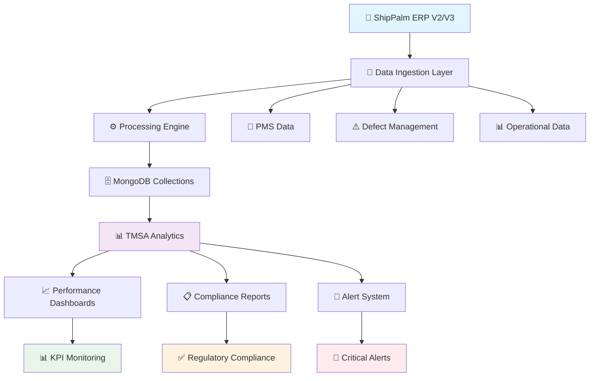
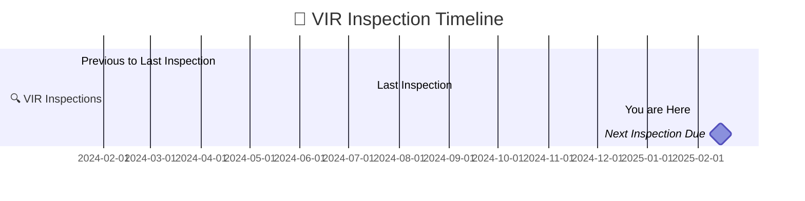
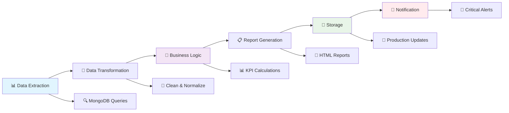

# 🚢 Tanker Management and Self Assessment (TMSA)
## *Advanced Maritime Fleet Management System*

---

<div align="center">

### 🌊 **Comprehensive Tanker Operations Excellence Platform** 🌊

*Powered by OCIMF Standards | Integrated with ShipPalm ERP | Real-time Compliance Monitoring*

</div>

---

## 📋 Executive Summary

The **TMSA (Tanker Management and Self Assessment)** system represents a state-of-the-art tanker fleet management platform that seamlessly integrates with ShipPalm ERP to deliver:

🎯 **Real-time operational monitoring**  
🎯 **Regulatory compliance tracking**  
🎯 **Performance analytics and KPI management**  
🎯 **OCIMF-compliant reporting and benchmarking**

---

## 🏗️ System Architecture Overview

### 🔧 Core Technology Stack

<div style="display: flex; justify-content: space-around; margin: 20px 0;">

| 🖥️ **Integration Layer** | 📊 **Analytics Engine** | 🔒 **Compliance Module** | 📈 **Reporting Suite** |
|:---:|:---:|:---:|:---:|
| ShipPalm ERP V2/V3 | Real-time KPI Monitoring | TMSA Element Tracking | Automated Report Generation |
| MongoDB Collections | Performance Dashboards | Regulatory Compliance | Critical Alert Management |
| API Gateway | Machine Learning Analytics | Certificate Management | Executive Dashboards |

</div>

### 🔄 Data Flow Architecture



---

## 🎯 TMSA Performance Dashboard

### 📊 Key Performance Indicators (KPI) Matrix

<div style="background: linear-gradient(135deg, #667eea 0%, #764ba2 100%); padding: 20px; border-radius: 10px; color: white; margin: 20px 0;">

#### 🏆 **TMSA Excellence Metrics**

| **KPI Category** | **Target** | **TMSA Element** | **Status** |
|:---|:---:|:---:|:---:|
| 🔧 **PMS Sync Health** | <36 hours | Element 6 | 🟢 |
| ⚡ **Critical Safety Equipment** | 0% overdue | Element 6 | 🟢 |
| 🔨 **Non-Critical Maintenance** | <3% overdue | Element 6 | 🟡 |
| 📋 **Certificate Compliance** | 30-day warning | Element 12 | 🟢 |
| 📦 **Critical Spares** | Above minimum | Element 6 | 🟢 |
| 📄 **Technical Forms** | 100% compliance | Element 6 | 🟢 |

</div>

---

## 🎛️ TMSA Task Management System (25 Tasks)

<div style="background: #f8f9fa; padding: 15px; border-radius: 8px; border-left: 4px solid #007bff;">

### 🎯 **Task Categories Overview**

**🔧 Maintenance Excellence (Tasks 1-8)** | **🛡️ Safety & Compliance (Tasks 9-19)** | **📊 Analytics & Reporting (Tasks 20-25)**

</div>

---

### 🔧 **Task 1: Machinery Running Hours Counter Monitoring**

<div style="background: linear-gradient(90deg, #4CAF50, #45a049); padding: 15px; border-radius: 8px; color: white; margin: 10px 0;">

**🎯 Objective**: Advanced monitoring system for critical machinery running hours counters  
**📋 TMSA Element**: Element 2 (Navigation)  
**⏰ Threshold**: 15-day update requirement

</div>

#### 🔍 **Implementation Strategy**:

**1. 📊 Data Extraction Task**:
   - Query PMS Machinery Counters Collection
   - Retrieve PMS Sync Data timestamps
   - Cross-reference with Common Vessel Details

**2. 🧮 Analysis Task**:
   ```python
   def generate_sentence(row):
       pms_sync_time = pd.to_datetime(row['pmsSyncDate']).strftime('%d %b %y, %H%M Hrs LT')
       source_str = format_source(row['source'])
       if row['15_days_or_more'] == 0:
           return f"✅ According to ShipPalm {source_str}, all machinery counters updated within 15 days"
       elif row['15_days_or_more'] == 1:
           return f"⚠️ According to ShipPalm {source_str}, 1 machinery counter overdue >15 days"
       else:
           return f"🚨 According to ShipPalm {source_str}, {row['15_days_or_more']} machinery counters overdue >15 days"
   ```

**3. 📈 Report Generation Task**:
   - 🎨 Color-coded status tables
   - 📊 Vessel-wise summary dashboards
   - 📧 Automated alert notifications

**4. 🚨 Alert Management Task**:
   - 📱 Real-time notifications for technical teams
   - 📈 Management escalation protocols

<div style="background: #d4edda; border: 1px solid #c3e6cb; padding: 10px; border-radius: 5px; margin: 10px 0;">
<strong>✅ Success Criteria:</strong> All critical machinery running hours counters updated within 15-day threshold ensuring accurate maintenance scheduling and TMSA compliance
</div>

---

### ⚙️ **Task 2: PMS Functionality Verification**

<div style="background: linear-gradient(90deg, #2196F3, #1976D2); padding: 15px; border-radius: 8px; color: white; margin: 10px 0;">

**🎯 Objective**: Continuous verification system for vessel PMS functionality  
**📋 TMSA Element**: Element 6 (Reliability and Maintenance Standards)  
**⏰ Threshold**: 36-hour sync monitoring

</div>

#### 🔍 **Implementation Strategy**:

**1. 🔍 System Health Check Task**:
   - 📡 Monitor PMS sync timestamps
   - ✅ Verify system accessibility
   - 🔒 Check data integrity

**2. 📊 Sync Analysis Task**:
   ```python
   def calculate_time_difference(pms_sync_date):
       current_time = pd.Timestamp.now()
       time_diff_hours = (current_time - pms_sync_date).total_seconds() / 3600
       return round(time_diff_hours)

   def generate_sentence(doc, time_diff_data):
       if time_diff_data['hour_difference'] >= 36:
           return f"⚠️ PMS functional but sync overdue: {time_diff_data['last_sync_date']}"
       else:
           return f"✅ PMS fully functional, last sync: {time_diff_data['last_sync_date']}"
   ```

**3. 🚦 Status Reporting Task**:
   - **🟢 Green**: Sync within 36 hours (System Healthy)
   - **🔴 Red**: Sync overdue >36 hours (Action Required)

<div style="background: #d4edda; border: 1px solid #c3e6cb; padding: 10px; border-radius: 5px; margin: 10px 0;">
<strong>✅ Success Criteria:</strong> All vessel PMS systems maintain <36 hour sync intervals ensuring continuous maintenance planning and TMSA compliance
</div>

---

### 🔄 **Task 3: PMS Shore Synchronization Management**

<div style="background: linear-gradient(90deg, #FF9800, #F57C00); padding: 15px; border-radius: 8px; color: white; margin: 10px 0;">

**🎯 Objective**: Comprehensive monitoring for PMS synchronization between vessel and shore systems

</div>

#### 🔍 **Implementation Strategy**:

**1. 📡 Sync Status Monitoring Task**:
   - 🕐 Track real-time sync timestamps
   - 🖥️ Monitor V2/V3 system status
   - 📈 Analyze sync frequency patterns

**2. 📋 Status Summary Generation Task**:
   ```python
   def generate_summary(doc, time_diff_data):
       summary = f"📊 PMS accessible in ShipPalm {doc['status'].upper()}"
       if time_diff_data['hour_difference'] != 0:
           summary += f" - last sync {time_diff_data['hour_difference']} hours ago"
       return summary
   ```

---

### ⚠️ **Task 4: Non-Critical Maintenance Jobs Overdue Management (30+ Days)**

<div style="background: linear-gradient(90deg, #9C27B0, #7B1FA2); padding: 15px; border-radius: 8px; color: white; margin: 10px 0;">

**🎯 Objective**: Advanced tracking system for non-critical planned maintenance jobs  
**📋 TMSA Element**: Element 6 (Reliability and Maintenance Standards)  
**⏰ Threshold**: 30-day overdue monitoring

</div>

#### 🔍 **Implementation Strategy**:

**2. 🧮 Overdue Calculation Task**:
   ```python
   def calculate_overdue_percentages(df):
       nonCritical_df = df[(df['dept'] != 'Critical') & (df['intervalType'] != 'Hours')]
       current_date = pd.Timestamp.now()
       
       nonCritical_df['is_overdue'] = (
           (nonCritical_df['jobStatus'] == 'Overdue') & 
           ((current_date - nonCritical_df['jobDueDate']).dt.days > 30)
       )
       
       grouped = nonCritical_df.groupby('imo').agg(
           total_nonCritical=('dept', 'count'),
           overdue_count=('is_overdue', 'sum')
       ).reset_index()
       
       return grouped
   ```

---

### 🚨 **Task 5: Critical Safety Equipment Maintenance Jobs Overdue Management (10+ Days)**

<div style="background: linear-gradient(90deg, #F44336, #D32F2F); padding: 15px; border-radius: 8px; color: white; margin: 10px 0;">

**🎯 Objective**: High-priority monitoring for critical safety equipment maintenance  
**📋 TMSA Element**: Element 6 (Reliability and Maintenance Standards)  
**⚠️ Critical Threshold**: 10-day maximum tolerance

</div>

#### 🔍 **Implementation Strategy**:

**2. 🚨 Overdue Analysis Task**:
   ```python
   def calculate_overdue_percentages(df):
       critical_df = df[(df['dept'] == 'Critical') & (df['intervalType'] != 'Hours')]
       current_date = pd.Timestamp.now()
       
       critical_df['is_overdue'] = (
           (critical_df['jobStatus'] == 'Overdue') & 
           ((current_date - critical_df['jobDueDate']).dt.days > 10)
       )
       
       return critical_df.groupby('imo').agg(
           total_Critical=('dept', 'count'),
           overdue_count=('is_overdue', 'sum')
       ).reset_index()
   ```

<div style="background: #f8d7da; border: 1px solid #f5c6cb; padding: 10px; border-radius: 5px; margin: 10px 0;">
<strong>🚨 Success Criteria:</strong> Zero tolerance for critical safety equipment maintenance jobs overdue beyond 10 days to ensure vessel operational safety and regulatory compliance
</div>

---

### 📊 **Task 6: Non-Critical Jobs KPI Monitoring**

<div style="background: linear-gradient(90deg, #607D8B, #455A64); padding: 15px; border-radius: 8px; color: white; margin: 10px 0;">

**🎯 Objective**: Automated monitoring system for non-critical job overdue percentage  
**📈 KPI Target**: 3% maximum overdue threshold

</div>

#### 🔍 **Implementation Strategy**:

**2. 🧮 Calculation Task**:
   ```python
   def calculate_overdue_percentages(df):
       nonCritical_df = df[df['dept'] != 'Critical']
       
       grouped = nonCritical_df.groupby('imo').agg(
           total_nonCritical=('dept', 'count'),
           overdue_count=('is_overdue', 'sum')
       ).reset_index()
       
       # Calculate percentage against KPI target
       grouped['percentage'] = ((grouped['overdue_count'] / grouped['total_nonCritical']) * 100).round(2)
       
       return grouped
   ```

**3. 📊 Performance Assessment Task**:
   - **🟢 Green Status**: ≤3% overdue (KPI Met)
   - **🟡 Yellow Status**: 3-5% overdue (KPI Warning)
   - **🔴 Red Status**: >5% overdue (KPI Failed)

---

### 🎯 **Task 7: Critical Jobs KPI Management (0% Threshold)**

<div style="background: linear-gradient(90deg, #E91E63, #C2185B); padding: 15px; border-radius: 8px; color: white; margin: 10px 0;">

**🎯 Objective**: Zero tolerance policy for overdue critical jobs  
**📈 KPI Target**: 0% - Absolute compliance requirement

</div>

<div style="background: #f8d7da; border: 1px solid #f5c6cb; padding: 10px; border-radius: 5px; margin: 10px 0;">
<strong>🎯 Success Criteria:</strong> Achieve and maintain 0% overdue critical jobs across all vessels
</div>

---

### 🔄 **Task 8: Shore Synchronization Management**

<div style="background: linear-gradient(90deg, #00BCD4, #0097A7); padding: 15px; border-radius: 8px; color: white; margin: 10px 0;">

**🎯 Objective**: Comprehensive tracking for ShipPalm synchronization with shore systems

</div>

#### 🔍 **Implementation Strategy**:

**2. ⏰ Time Difference Calculation Task**:
   ```python
   def calculate_time_difference(report_date):
       current_time = datetime.now()
       time_diff_hours = (current_time - report_date).total_seconds() / 3600
       last_sync_date = report_date.strftime("%d %b %y, %H%M Hrs LT")
       
       return {
           'hour_difference': round(time_diff_hours),
           'last_sync_date': last_sync_date
       }
   ```

---

### 🛢️ **Task 9: Cargo Tank Inspection Management**

<div style="background: linear-gradient(90deg, #795548, #5D4037); padding: 15px; border-radius: 8px; color: white; margin: 10px 0;">

**🎯 Objective**: Comprehensive management system for cargo tank inspection documentation  
**📋 TMSA Element**: Element 4 (Cargo and Ballast Systems) + SIRE compliance

</div>

**📄 File Classification Logic**:
```python
def get_nonempty_group_names(file_info):
    groups = {
        'RA': set(),  # Risk Assessment
        'OP-12': set(),  # Operational Reports
        'PTW': set(),  # Permit to Work
        'CARGO TANK INSPECTION RA': set(),
        'CARGO TANK INSPECTION REPORT': set(),
        'images': set(),
        'documents': set()
    }
    
    # Pattern matching for file categorization
    for file in files:
        if re.search(r'(ra|risk.*assessment)', file.lower()):
            groups['RA'].add(file)
        elif re.search(r'(cargo.*tank.*inspection)', file.lower()):
            groups['CARGO TANK INSPECTION REPORT'].add(file)
        # ... additional patterns
    
    return format_group_names(groups)
```

**📋 Document Types Tracked**:
- 🔍 Risk Assessments (RA/SF-23)
- 📊 Operational Reports (OP-12)
- ✅ Permits to Work (PTW)
- 📄 Inspection Reports
- 📸 Supporting Images/Documents

---

### 🕳️ **Task 10: Void Space/Cofferdam Inspection Management**

<div style="background: linear-gradient(90deg, #3F51B5, #303F9F); padding: 15px; border-radius: 8px; color: white; margin: 10px 0;">

**🎯 Objective**: Advanced tracking system for void space and cofferdam inspection records  
**📋 TMSA Element**: Element 4 (Cargo and Ballast Systems) + MARPOL Annex I

</div>

**🔍 Pattern Recognition**:
```python
def get_nonempty_group_names(file_info):
    patterns = {
        'VOID SPACE OR COFFERDAM INSPECTION': r'(void\s*space|cofferdam|inspection)',
        'RA': r'(sf-?23|rasf-?23|ra)',
        'OP-12': r'(op-?12|condition\s*report)',
        'PTW': r'(ptw|permit\s*to\s*work)'
    }
    
    for file in files:
        for group, pattern in patterns.items():
            if re.search(pattern, file.lower(), re.IGNORECASE):
                groups[group].add(file)
```

---

### 💧 **Task 11: Ballast Water Tank Inspection Management**

<div style="background: linear-gradient(90deg, #009688, #00695C); padding: 15px; border-radius: 8px; color: white; margin: 10px 0;">

**🎯 Objective**: Monitoring system for ballast water tank inspection compliance  
**📋 TMSA Element**: Element 4 (Cargo and Ballast Systems) + BWM Convention

</div>

**🔑 Key Features**:
- 🧪 WBT TST (Water Ballast Tank Test) tracking
- 📋 Inspection report management
- ✅ Compliance documentation
- 🌍 Environmental regulation adherence

---

### 📋 **Task 12: Deferred Jobs Management**

<div style="background: linear-gradient(90deg, #FF5722, #D84315); padding: 15px; border-radius: 8px; color: white; margin: 10px 0;">

**🎯 Objective**: Comprehensive tracking system for deferred maintenance jobs

</div>

**📊 HTML Generation Logic**:
```python
def generate_html(df):
    for index, row in df.iterrows():
        total_deferred = row['totalDefered']
        critical_count = row['critical']
        non_critical_count = row['nonCritical']
        
        if total_deferred == 0:
            entry_html = "✅ There are no deferred jobs."
        elif total_deferred == 1:
            entry_html = "⚠️ There is 1 deferred job:"
        else:
            entry_html = f"🚨 There are {total_deferred} deferred jobs:"
            
        # Add breakdown by criticality
        if critical_count > 0:
            entry_html += f"- 🚨 Critical: {critical_count}"
        if non_critical_count > 0:
            entry_html += f"- ⚠️ Non-Critical: {non_critical_count}"
```

---

### 🎛️ **Task 13: Centralized Job Management**

<div style="background: linear-gradient(90deg, #8BC34A, #689F38); padding: 15px; border-radius: 8px; color: white; margin: 10px 0;">

**🎯 Objective**: Centralized system for job tracking and management

</div>

**🔧 Core Functions**:
- 📊 Job status monitoring
- 🎯 Priority classification
- 📦 Resource allocation
- 📈 Performance metrics

---

### 🏛️ **Task 14: Classification Society Survey & CoC Management**

<div style="background: linear-gradient(90deg, #CDDC39, #AFB42B); padding: 15px; border-radius: 8px; color: white; margin: 10px 0;">

**🎯 Objective**: Tracking system for classification society surveys and Conditions of Class  
**📋 TMSA Element**: Element 12 (Inspections, Audits and Industry Benchmarking)

</div>

**📊 Data Processing**:
```python
# CoC (Condition of Class) filtering
classanswer = final_df[final_df['criticality'] == 'CoC']

# HTML tag removal from comments
classanswer['comment'] = classanswer['comment'].str.replace(r'<.*?>', '', regex=True)

# Date formatting
classanswer['issueDate'] = classanswer['issueDate'].dt.strftime('%b %d, %Y')
classanswer['dueDate'] = classanswer['dueDate'].dt.strftime('%b %d, %Y')
```

**📋 Tracking Elements**:
- 📅 Survey due dates
- ✅ CoC compliance status
- 🏛️ Class society requirements
- 📜 Certificate validity

---

### ⚠️ **Task 15: Marine Defect and Incident Management System**

<div style="background: linear-gradient(90deg, #FFC107, #FF8F00); padding: 15px; border-radius: 8px; color: white; margin: 10px 0;">

**🎯 Objective**: Comprehensive system for marine defect and incident tracking  
**📋 TMSA Element**: Element 10 (Incident Investigation and Analysis)

</div>

**📊 Data Integration**:
- 🔧 Defect HMX V3 Collection
- 📋 ADI (Accident/Damage/Incident) tracking
- ⚠️ Near-miss reporting
- 🔍 Internal audit findings
- 🏥 IFFR (Injury/Fatality/First Aid) records

**📊 Status Categories**:
- 🔓 Open defects
- 🔍 Under investigation
- 📋 Review in progress
- ✏️ Under amendment
- ✅ Closed/Resolved

---

### 📈 **Task 16: Defect Analysis & Reporting**

<div style="background: linear-gradient(90deg, #673AB7, #512DA8); padding: 15px; border-radius: 8px; color: white; margin: 10px 0;">

**🎯 Objective**: Advanced defect analytics and trend analysis system

</div>

**🔧 Component Tracking**:
```python
# Component explosion for detailed analysis
df_component = df.explode('component').reset_index(drop=True)

# Corrective action normalization
correctiveAction_expanded = pd.json_normalize(df_component['correctiveAction'])

# Deduplication logic
df['ca_unique_key'] = (
    df['Reference No'].astype(str) + "_" + 
    df['CA Target Date'].astype(str) + "_" + 
    df['CA Id'].fillna('').astype(str)
)
```

---

### 🔗 **Task 17: Third Party Marine Inspection Integration**

<div style="background: linear-gradient(90deg, #9E9E9E, #616161); padding: 15px; border-radius: 8px; color: white; margin: 10px 0;">

**🎯 Objective**: Integration system for third-party marine inspection observations  
**📋 TMSA Element**: Element 12 (SIRE, CDI, Port State Control)

</div>

**📊 Current Status**: 
```python
active_vessels['answer'] = "🔄 Observations of Third party inspection cannot be linked to ShipPalm."
```

**🚀 Future Enhancement**: Integration with external inspection systems

---

### 📊 **Task 18: Data Analysis & Processing**

<div style="background: linear-gradient(90deg, #607D8B, #37474F); padding: 15px; border-radius: 8px; color: white; margin: 10px 0;">

**🎯 Objective**: System to parse and analyze data from task 120

</div>

**🔧 Processing Logic**:
```python
def parse_data_field(x):
    if isinstance(x, dict):
        return x
    if isinstance(x, str):
        try:
            return json.loads(x)
        except Exception:
            return None
    return None

# Table structure extraction
headers = table_rows.iloc[0]['data_parsed']['headers']
header_names = [h.get('name') or h.get('headerName') for h in headers]
```

---

### 📜 **Task 19: Statutory and Class Certificate Expiry Tracking**

<div style="background: linear-gradient(90deg, #FF9800, #E65100); padding: 15px; border-radius: 8px; color: white; margin: 10px 0;">

**🎯 Objective**: Monitoring system for statutory and classification certificate expiration  
**📋 TMSA Element**: Element 12 (Inspections, Audits and Industry Benchmarking)

</div>

**⏰ Expiry Logic**:
```python
# Convert expiry dates
classdata['expiryDate'] = pd.to_datetime(classdata['expiryDate'], errors='coerce')

# Filter expired certificates
current_time = pd.Timestamp.now()
classdata = classdata[classdata['expiryDate'] <= current_time]
```

**📜 Certificate Types**:
- 🏛️ Class certificates
- 📋 Statutory certificates
- 🛡️ Safety certificates
- 🌍 Environmental certificates

---

### 📊 **Task 20: Comprehensive Defect Reporting**

<div style="background: linear-gradient(90deg, #4CAF50, #2E7D32); padding: 15px; border-radius: 8px; color: white; margin: 10px 0;">

**🎯 Objective**: Master defect reporting system with multi-source integration including VIR compliance analysis

</div>

**📊 Data Sources**:
- 🔧 Defect HMX V3/V2
- 📋 ADI (Accident/Damage/Incident)
- ⚠️ Near-miss reports
- 🔍 Internal audits
- 🏥 IFFR records
- 📊 Class status notifications
- 📋 VIR compliance data

**🔗 Integration Logic**:
```python
# Multi-collection data aggregation
collections = [
    collection_adiv3, collection_nmv3, collection_iffrv3,
    collection_adiv2, collection_nmv2, collection_iav2, collection_iffrv2
]

# Unified data processing
for collection in collections:
    data = collection.find(query, projection)
    # Process and merge data
```

**📋 VIR Compliance Analysis**:
```python
def generate_html_content(comply1, comply2, comply3, overallcomply, today, inspdate, 
                         month_difference, and_days, lastsailingdate, sailing_days_difference):
    
    html_content = f"""
    ## 📊 VIR Compliance Status Analysis
    
    **📅 Date:** {today.strftime('%d %b %Y')}
    **📊 Data Source:** VIR App
    
    ### ✅ Compliance Conditions:
    
    | **Condition**       | **Statement**                                                    | **Result**      |
    |--------------------|----------------------------------------------------------------------------------|----------------|
    | **Condition 1**     | Duration between two inspections ≤ 6 months                                      | {comply1}   |
    | **Condition 2**     | At least one sailing VIR in the calendar year                                   | {comply2}    |
    | **Condition 3**     | Duration between two consecutive sailing inspections ≤ 365 days                 | {comply3}    |
    | **Overall**         | **Overall compliance based on above conditions**                                 | **{overallcomply}**|
    
    ### 🧮 Mathematical Formulas:
    
    **Condition 1**: $$\\frac{{\\text{{Last Inspection Date}} - \\text{{Present Date}}}}{{\\text{{Months}}}} \\leq \\text{{6 months}}$$
    
    **Condition 2**: $$\\text{{Sailing Inspection Count}} \\geq 1  \\text{{(In present calendar year)}}$$
    
    **Condition 3**: $$\\text{{Present Date}} - \\text{{Last Sailing Inspection Date}} \\leq \\text{{365 days}}$$
    
    ### 📈 Timeline Highlighting Current, Past Two Inspection Dates, and Next VIR Due Date
    """
    
    return html_content
```

**📈 Timeline Visualization Logic**:
```python
def create_timeline_data(prevtolast_enddate, end_date, get_next_date_, prevtolast_type, instype, get_next_type):
    
    timelinedf = pd.DataFrame({
        'name': ['Previous to Last Inspection', 'Last Inspection', 'You are Here', 'Next Inspection Due'],
        'label': [
            f"{prevtolast_enddate.strftime('%d %b %Y') if pd.notnull(prevtolast_enddate) else 'No Data'}<br>Mode of VIR: {prevtolast_type}",
            f"{end_date.strftime('%d %b %Y') if pd.notnull(end_date) else 'No Data'}<br>Mode of VIR: {instype}",
            f"{datetime.now().strftime('%d %b %Y')}",
            f"{get_next_date_.strftime('%d %b %Y') if pd.notnull(get_next_date_) else 'No Data'}<br>Mode of VIR: {get_next_type}"
        ],
        'color': ['brown','green', 'blue', 'orange'],
        'date': [prevtolast_enddate, end_date, datetime.now(), get_next_date_]
    })
    
    # Sort timeline by date while keeping first two positions fixed
    first_two_rows = timelinedf.iloc[:2]
    remaining_rows = timelinedf.iloc[2:]
    remaining_rows_sorted = remaining_rows.sort_values(by='date').reset_index(drop=True)
    timelinedf = pd.concat([first_two_rows, remaining_rows_sorted], ignore_index=True)
    
    # Mark current position as red if it's the last item
    if timelinedf['name'].iloc[-1] == 'You are Here':
        timelinedf['color'].iloc[-1] = 'red'
    
    timeline_data = {
        'chartData': [{'data': timelinedf.to_dict('records')}],
        'type': 'timeline',
        'height': 400
    }
    
    return timeline_data
```

**📊 VIR Timeline Visualization**:



**🧮 Compliance Calculation Logic**:
```python
# Condition 1: Duration between inspections ≤ 6 months
difference = relativedelta(today, inspdate)
month_difference = difference.years * 12 + difference.months
and_days = difference.days if difference.days > 0 else 0

if month_difference < 6:
    comply1 = 'Met'
elif month_difference == 6 and and_days == 0:
    comply1 = 'Met'
else:
    comply1 = 'Not Met'

# Condition 2: At least one sailing VIR in calendar year
current_year = datetime.now().year
sailing_sea_inspections = current_year_data[
    current_year_data['VIRdata_inspectionMode'].fillna('').str.contains(
        r'\bSAILING|SEA\b', case=False, regex=True
    )
]
comply2 = 'Met' if not sailing_sea_inspections.empty else 'Not Met'

# Condition 3: Sailing inspection interval ≤ 365 days
sailing_days_difference = datetime.now() - lastsailingdate if pd.notna(lastsailingdate) else None
one_year = pd.Timedelta(days=365)
comply3 = 'Met' if sailing_days_difference < one_year else 'Not Met'

# Overall compliance
overallcomply = 'Met' if comply1 == comply2 == comply3 == 'Met' else 'Not Met'
```

---

### 🤖 **Task 21: TMSA Analysis Engine**

<div style="background: linear-gradient(90deg, #E91E63, #AD1457); padding: 15px; border-radius: 8px; color: white; margin: 10px 0;">

**🎯 Objective**: AI/ML system for TMSA data processing and analysis

</div>

**🔗 API Integration**:
```python
def process_and_fetch_api(input_df, api_url):
    # Batch processing for efficiency
    batch_size = len(df)
    content_list = []
    
    for start in range(0, len(df), batch_size):
        batch_df = df.iloc[start:start + batch_size].copy()
        batch_df["query"] = batch_df['answer']
        
        # API call for analysis
        response = requests.post(api_url, json=batch_data)
        # Process response
```

**🤖 AI Enhancement**: OpenAI integration for intelligent analysis

---

### 🚨 **Task 22: Critical Deferred Jobs Management**

<div style="background: linear-gradient(90deg, #F44336, #C62828); padding: 15px; border-radius: 8px; color: white; margin: 10px 0;">

**🎯 Objective**: Focused management system for critically deferred maintenance jobs

</div>

**🎨 Status Color Coding**:
```python
def get_status_color(status):
    if status == "Overdue":
        return {"status": "Overdue", "color": "red"}
    elif status == "Due":
        return {"status": "Due", "color": "orange"}
    else:
        return {"status": status, "color": "green"}
```

**📊 Priority Matrix**:
- 🔴 **Red**: Overdue critical jobs
- 🟠 **Orange**: Due critical jobs
- 🟢 **Green**: Completed/On-track

---

### 📦 **Task 23: Critical Marine Spares Inventory Management**

<div style="background: linear-gradient(90deg, #795548, #4E342E); padding: 15px; border-radius: 8px; color: white; margin: 10px 0;">

**🎯 Objective**: Monitoring system for critical marine spare parts inventory levels  
**📋 TMSA Element**: Element 6 (Reliability and Maintenance Standards)

</div>

**📊 Inventory Logic**:
```python
def criticalSpares_pms(data):
    for imo, group in data.groupby('imo'):
        remaining_on_board = group['Remaining On Board Quantity']
        minimum_stock = group['Minimum Stock Level']
        
        # Calculate spares below reorder level
        below_reorder = remaining_on_board < minimum_stock
        critical_spares_below_reorder = below_reorder.sum()
        
        if critical_spares_below_reorder > 0:
            status = "🚨 Action Required"
            remarks = f"{critical_spares_below_reorder} critical spares below minimum stock"
        else:
            status = "✅ Adequate Stock"
            remarks = "All critical spares above minimum stock level"
```

**📊 Stock Level Monitoring**:
- 📦 Remaining on Board (ROB) quantity
- ⚠️ Minimum stock level thresholds
- 🔄 Reorder point calculations
- 📱 Automated alerts for low stock

---

### 📄 **Task 24: TE-22 Technical Form Verification**

<div style="background: linear-gradient(90deg, #3F51B5, #1A237E); padding: 15px; border-radius: 8px; color: white; margin: 10px 0;">

**🎯 Objective**: Verification system for TE-22 technical form attachments  
**📋 TMSA Element**: Element 6 (Reliability and Maintenance Standards)

</div>

**🔍 Pattern Recognition**:
```python
def te22_attached(row):
    dataFrom = row.get('dataFrom', '').upper()
    
    if dataFrom == 'V2':
        # Check caption field for V2 systems
        caption = row.get('caption', '')
        if re.search(r'(te-?22|te\s*22|te22)', caption.lower()):
            return True
            
    elif dataFrom == 'V3':
        # Check fileTitle and fileName for V3 systems
        for key in ['fileTitle', 'fileName']:
            val = row.get(key, '')
            if re.search(r'(te-?22|te\s*22|te22)', val.lower()):
                return True
    
    return False
```

**✅ Form Validation**:
- 📄 TE-22 technical form compliance
- 🔄 Version-specific field checking
- 🔍 Pattern matching algorithms
- 📎 Attachment verification

---

### ⚡ **Task 25: TE-44 Critical Equipment Performance Test Verification**

<div style="background: linear-gradient(90deg, #FF5722, #BF360C); padding: 15px; border-radius: 8px; color: white; margin: 10px 0;">

**🎯 Objective**: Verification system for TE-44 Critical Equipment Monthly Performance Test  
**📋 TMSA Element**: Element 6 (Reliability and Maintenance Standards)

</div>

**🔍 Enhanced Pattern Recognition**:
```python
def te44_attached(row):
    patterns = [
        r'(te-?44|te\s*44|te44)',
        r'(critical\s+equipment\s+monthly\s+performance\s+test)',
        r'(performance\s+test\s+report)',
        r'(.*CRITICAL EQUIPMENT MONTHLY PERFORMANCE TEST.*)'
    ]
    
    for key in ['caption', 'fileName', 'fileType', 'fileTitle']:
        val = row.get(key, '')
        if isinstance(val, str) and val.strip():
            for pattern in patterns:
                if re.search(pattern, val.lower(), re.IGNORECASE):
                    return True
    
    return False
```

**📊 Test Coverage**:
- ⚡ Critical equipment performance
- 📅 Monthly test reports
- ✅ Compliance documentation
- 📈 Performance trend analysis

---

## 🏗️ Technical Implementation Framework

<div style="background: linear-gradient(135deg, #1e3c72 0%, #2a5298 100%); padding: 20px; border-radius: 10px; color: white; margin: 20px 0;">

### 🗄️ **Database Architecture Excellence**

</div>

**🔑 Primary Data Collections**:
- 🔧 **Planned Maintenance System**: Maintenance job tracking and scheduling data
- ⚙️ **Machinery Counters**: Critical equipment running hours and operational data
- 🔄 **System Synchronization**: Real-time data sync timestamps and status
- 🚢 **Fleet Master Data**: Vessel particulars, specifications, and operational details
- ⚠️ **Marine Defect Management**: Incident tracking, corrective actions, and resolution data
- 🏛️ **Classification Society Data**: Survey records, certificate status, and compliance data

**🎛️ Operational Collections**:
- 📊 **TMSA Reports**: Task analysis results and compliance reports
- 📈 **Dashboard Components**: Interactive tables, charts, and performance metrics
- 📊 **Performance Indices**: KPI summaries and trend analysis data
- 📋 **Regulatory Documentation**: Compliance reports and audit trail storage

### 🔄 **Data Processing Pipeline Excellence**



**🔄 Process Flow**:
1. **📊 Data Extraction**: Query MongoDB collections for vessel operational data
2. **🔄 Data Transformation**: Clean, normalize, and validate maritime data
3. **🧮 Business Logic**: Apply TMSA KPI calculations and compliance rules
4. **📋 Report Generation**: Create HTML tables, dashboards, and summaries
5. **💾 Storage**: Update production collections with processed results
6. **📱 Notification**: Send alerts for critical issues and compliance violations

### ⚡ **Performance Optimization Excellence**

**📦 Batch Processing**:
```python
bulk_operations = []
for idx, row in dataframe.iterrows():
    bulk_operations.append(UpdateOne(
        {'imo': row['imo'], 'questionNo': question_number},
        {'$set': update_data},
        upsert=True
    ))

collection.bulk_write(bulk_operations)
```

**🔍 Index Strategy**:
- 🚢 IMO-based indexing for vessel queries
- 🔢 Question number indexing for report retrieval
- 🔗 Compound indexes for complex queries
- ⏰ TTL indexes for temporary data

### 🛡️ **Error Handling Excellence**

**📊 Missing Data Management**:
```python
missing_data = {}
for imo in active_vessels['imo']:
    if imo not in processed_data:
        missing_data[str(imo)] = "❌ Data not available"
        # Create default entry
        default_answer = "🚢 Vessel data not accessible in ShipPalm"
```

**✅ Data Validation**:
- 🔢 Type checking for numeric fields
- 📅 Date format validation
- ✅ Required field verification
- 📋 Business rule validation

---

## 📊 TMSA KPI Dashboard Integration Excellence

<div style="background: linear-gradient(135deg, #667eea 0%, #764ba2 100%); padding: 20px; border-radius: 10px; color: white; margin: 20px 0;">

### 🎯 **Key Performance Indicators (TMSA Compliant)**

</div>

<div style="display: grid; grid-template-columns: repeat(auto-fit, minmax(300px, 1fr)); gap: 20px; margin: 20px 0;">

<div style="background: #d4edda; border: 2px solid #c3e6cb; padding: 15px; border-radius: 10px;">
<strong>🔧 PMS Sync Health</strong><br>
Target: <36 hours<br>
TMSA Element: Element 6<br>
Status: 🟢 Excellent
</div>

<div style="background: #f8d7da; border: 2px solid #f5c6cb; padding: 15px; border-radius: 10px;">
<strong>⚡ Critical Safety Equipment</strong><br>
Target: 0% tolerance<br>
TMSA Element: Element 6<br>
Status: 🔴 Zero Tolerance
</div>

<div style="background: #fff3cd; border: 2px solid #ffeaa7; padding: 15px; border-radius: 10px;">
<strong>🔨 Non-Critical Maintenance</strong><br>
Target: <3% overdue<br>
TMSA Element: Element 6<br>
Status: 🟡 Monitor
</div>

<div style="background: #cce5ff; border: 2px solid #99ccff; padding: 15px; border-radius: 10px;">
<strong>📋 Certificate Compliance</strong><br>
Target: 30-day warning<br>
TMSA Element: Element 12<br>
Status: 🟢 Compliant
</div>

<div style="background: #e7f3ff; border: 2px solid #b3d9ff; padding: 15px; border-radius: 10px;">
<strong>📦 Critical Spares</strong><br>
Target: Above minimum<br>
TMSA Element: Element 6<br>
Status: 🟢 Adequate
</div>

<div style="background: #f0f8e7; border: 2px solid #d4e7c5; padding: 15px; border-radius: 10px;">
<strong>📄 Technical Forms</strong><br>
Target: 100% compliance<br>
TMSA Element: Element 6<br>
Status: 🟢 Complete
</div>

</div>

### 🚦 **Alert Thresholds**

<div style="display: flex; justify-content: space-around; margin: 20px 0;">

| Status | Threshold | Action Required |
|:---:|:---:|:---:|
| 🟢 **Green** | Within acceptable limits | Continue monitoring |
| 🟡 **Yellow** | Approaching threshold | Prepare action plan |
| 🔴 **Red** | Exceeds threshold | **Immediate action required** |

</div>

### 📅 **Reporting Frequency**

- **⚡ Real-time**: Critical alerts and system status
- **📅 Daily**: Sync status and overdue jobs
- **📊 Weekly**: Performance summaries and trends
- **📋 Monthly**: Comprehensive TMSA reports

---

## 🔗 Integration Points Excellence

<div style="background: linear-gradient(135deg, #f093fb 0%, #f5576c 100%); padding: 20px; border-radius: 10px; color: white; margin: 20px 0;">

### 🖥️ **ShipPalm ERP Integration**

</div>

- **🖥️ V2 Systems**: Legacy integration with caption-based document tracking
- **🚀 V3 Systems**: Modern API integration with structured data fields
- **📡 Sync Monitoring**: Real-time status tracking and alert generation
- **✅ Data Validation**: Cross-system data integrity checks

### 🌍 **External Maritime Systems**

- **🏛️ Classification Societies**: Certificate and survey data integration (DNV, ABS, LR, BV, NK, KR, CCS)
- **🏴 Port State Control Authorities**: PSC inspection and compliance data
- **⚓ Flag State Administrations**: Regulatory compliance monitoring and statutory requirements
- **🔍 Third-party Marine Inspectors**: SIRE, CDI, and external audit integration
- **🌊 OCIMF Systems**: TMSA benchmarking and industry best practices

---

## 🔒 Security & Compliance Excellence

<div style="background: linear-gradient(135deg, #667eea 0%, #764ba2 100%); padding: 20px; border-radius: 10px; color: white; margin: 20px 0;">

### 🛡️ **Data Protection**

</div>

- 🔐 Encrypted data transmission
- 👤 Role-based access control
- 📋 Audit trail maintenance
- 💾 Backup and recovery procedures

### ⚓ **Maritime Regulatory Compliance**

<div style="display: grid; grid-template-columns: repeat(auto-fit, minmax(250px, 1fr)); gap: 15px; margin: 20px 0;">

<div style="background: #e8f5e8; border-left: 4px solid #4CAF50; padding: 15px;">
<strong>🏆 TMSA 3 Compliance</strong><br>
Full compliance with OCIMF TMSA 3rd Edition requirements
</div>

<div style="background: #e3f2fd; border-left: 4px solid #2196F3; padding: 15px;">
<strong>⚓ ISM Code</strong><br>
International Safety Management Code compliance
</div>

<div style="background: #f3e5f5; border-left: 4px solid #9C27B0; padding: 15px;">
<strong>🌊 MARPOL Conventions</strong><br>
Pollution prevention compliance (Annex I-VI)
</div>

<div style="background: #fff3e0; border-left: 4px solid #FF9800; padding: 15px;">
<strong>🛡️ SOLAS Requirements</strong><br>
Safety of Life at Sea convention compliance
</div>

<div style="background: #ffebee; border-left: 4px solid #F44336; padding: 15px;">
<strong>🏴 Flag State Regulations</strong><br>
Flag state administration requirements
</div>

<div style="background: #e0f2f1; border-left: 4px solid #009688; padding: 15px;">
<strong>🔍 Port State Control</strong><br>
PSC inspections and vetting preparation
</div>

<div style="background: #e8eaf6; border-left: 4px solid #3F51B5; padding: 15px;">
<strong>💧 BWM Convention</strong><br>
Ballast Water Management compliance
</div>

<div style="background: #f1f8e9; border-left: 4px solid #8BC34A; padding: 15px;">
<strong>👥 MLC Requirements</strong><br>
Maritime Labour Convention compliance
</div>

</div>

---

## 🔧 Maintenance & Support Excellence

<div style="background: linear-gradient(135deg, #ffecd2 0%, #fcb69f 100%); padding: 20px; border-radius: 10px; margin: 20px 0;">

### 📊 **System Monitoring**

- 📈 Database performance monitoring
- 🔄 Sync status tracking
- ⚠️ Error rate monitoring
- 👤 User activity logging

### 🛠️ **Regular Maintenance**

- 🔍 Index optimization
- 📦 Data archival procedures
- ⚡ Performance tuning
- 🔒 Security updates

</div>

---

<div align="center" style="background: linear-gradient(135deg, #667eea 0%, #764ba2 100%); padding: 30px; border-radius: 15px; color: white; margin: 30px 0;">

## 🌟 **TMSA Excellence Achievement** 🌟

### *This comprehensive documentation covers the TMSA Task Management system (Tasks 1-25) integrated with ShipPalm ERP for complete tanker fleet management and OCIMF TMSA compliance monitoring in accordance with industry best practices and international maritime regulations.*

**🚢 Powering Maritime Excellence Through Technology**

---

### 📞 **Contact Information**
**Technical Support**: support@tmsa-system.com  
**Emergency Hotline**: +1-800-TMSA-HELP  
**Documentation Portal**: docs.tmsa-system.com

</div>

---

*© 2024 TMSA Management System. All rights reserved. Built with maritime excellence in mind.*
